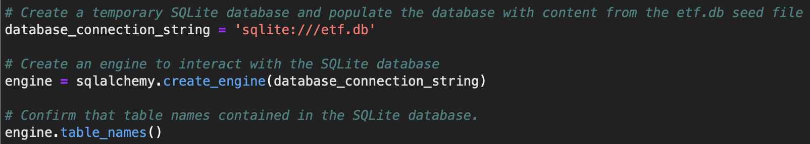
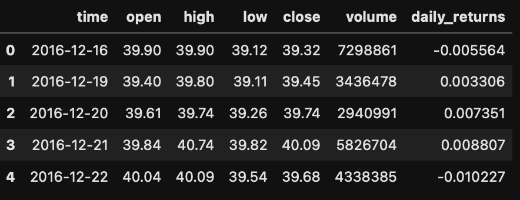
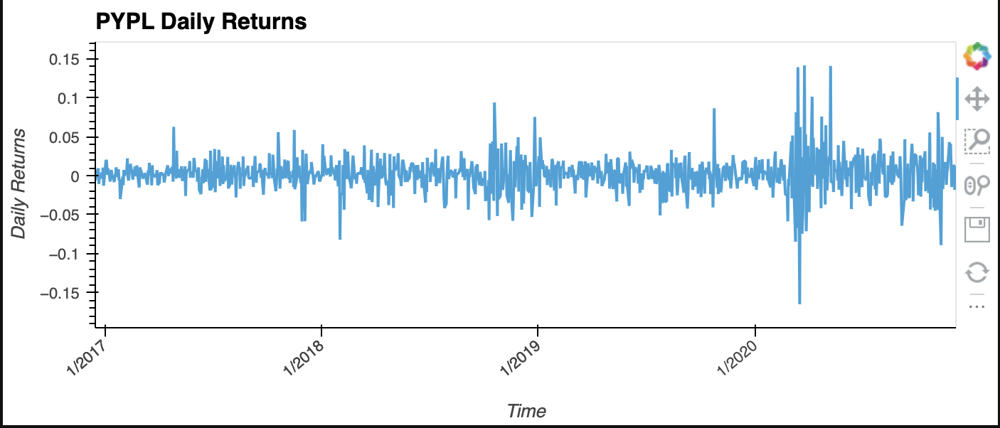
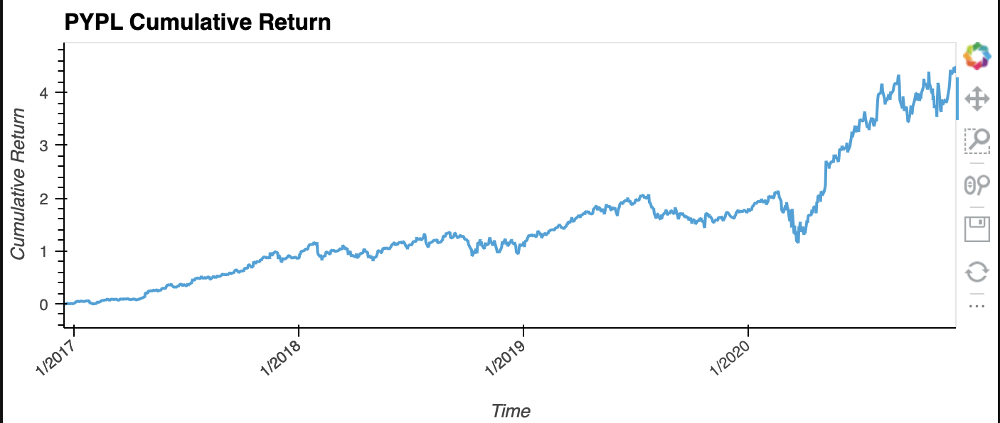
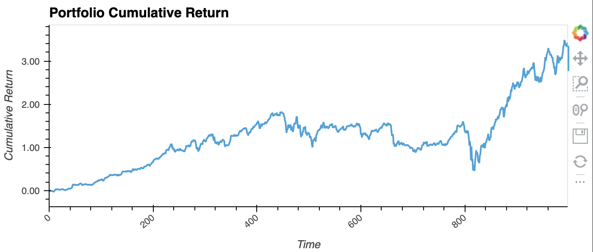

# etf_analyzer

This notebook builds a financial database and analyzes the performance of a FinTech ETF and dsiplays it as a web application.

---

## Technologies

This application runs in a Jupyter Notebook.  

It imports:
- numpy
- pandas
- hvplot
- sqlalchemy

---

## Installation Guide

This software does not require installation.  However, it does require the etf.db file that is included and should be in the root folderSimply navigate to the appropriate directory in your terminal and launch a Jupyter Notebook.  Then open the file called financial_planning_tools.ipynb.

---

## Usage

This application begins by accessing the data in the ETF database.

After accessing the data, it provides several tables, like the one below to allow for data verification and cleaning.

Next, a visualization of the daily returns of Paypal (PYPL) is provided.

Followed by a visualization of the cumulative returns for Paypal.

Finally, it optimizes the SQL data and provides a combined cumulative return for the entire ETF.

---

## Contributors

This project was created as a part of the Rice FinTech Bootcamp.

---

## License

This software is licensed for use under the included MIT License.
